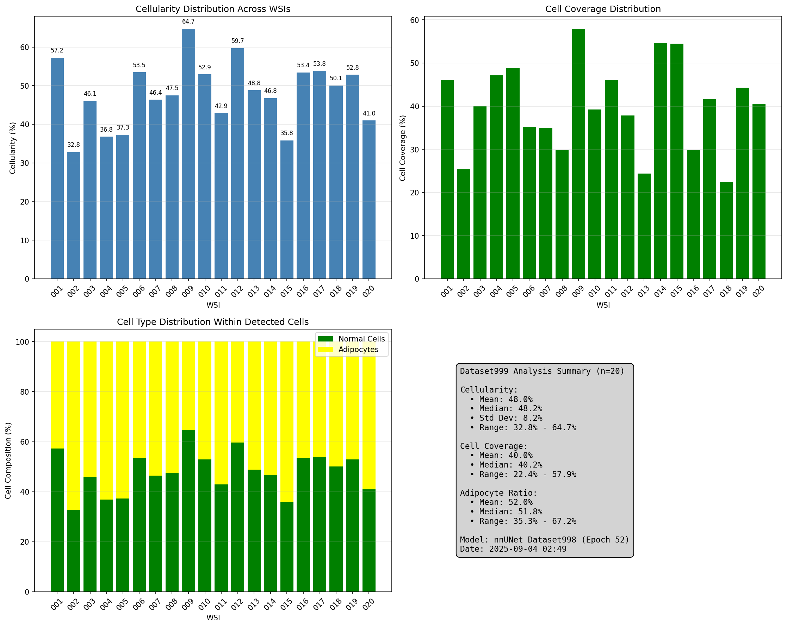
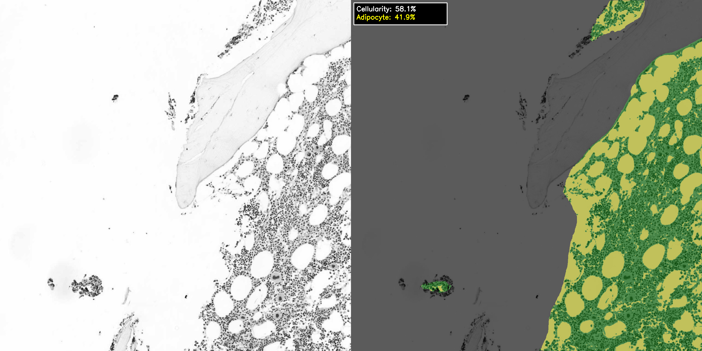
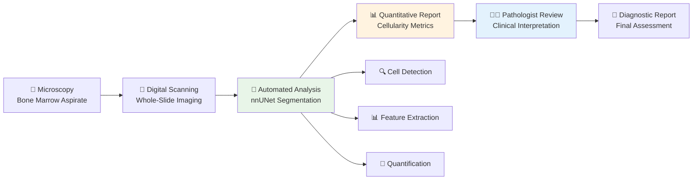
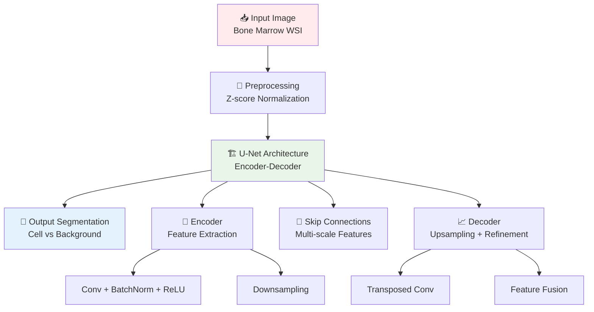

<div align="center">

<!-- Project Logo/Header -->

<h1>
  
</h1>

<!-- Project Description -->

<h3>🔬 Automated Bone Marrow Cellularity Quantification using nnUNet</h3>

<!-- Key Achievement -->

<div style="background: linear-gradient(135deg, #667eea 0%, #764ba2 100%); border-radius: 15px; padding: 20px; margin: 20px 0; box-shadow: 0 8px 32px rgba(31, 38, 135, 0.37);">
  <h4 style="color: white; margin: 0; font-style: italic;">
    🎯 "Objective, reproducible cellularity assessment eliminating inter-observer variability"
  </h4>
  <p style="color: #f0f0f0; margin: 10px 0 0 0; font-size: 14px;">
    nnUNet-based automated system achieves <strong>mean cellularity of 48.0% ± 9.5%</strong> across 20 whole-slide images with <strong>robust performance</strong> across diverse morphologies and staining variations.
  </p>
</div>

<!-- Badges -->

[](https://python.org)
[](https://pytorch.org)
[](https://github.com/MIC-DKFZ/nnUNet)
[](https://git-lfs.github.com/)
[](https://opensource.org/licenses/MIT)
[](https://github.com/LeGenAI/Automated_cellularity_assessment)

<!-- Graphical Abstract -->

<p align="center">
  
</p>

<p align="center">
  <strong>🎨 Graphical Abstract: Automated Cellularity Assessment Pipeline</strong><br>
  <em>From whole-slide imaging to quantitative cellularity analysis</em>
</p>

</div>

---

## 📋 Table of Contents

<details>
<summary>📖 Click to expand table of contents</summary>

- [🎯 Key Achievements](#-key-achievements)
- [✨ Novel Contributions](#-novel-contributions)
- [🛠️ Core Capabilities](#️-core-capabilities)
- [📊 Performance Results](#-performance-results)
- [🏗️ Architecture Overview](#️-architecture-overview)
- [🚀 Quick Start](#-quick-start)
- [💾 Installation](#-installation)
- [📦 Model Checkpoints](#-model-checkpoints)
- [📚 Usage Examples](#-usage-examples)
- [🧪 Experiments &amp; Demos](#-experiments--demos)
- [📈 Detailed Results](#-detailed-results)
- [🔬 Clinical Applications](#-clinical-applications)
- [📂 Dataset Information](#-dataset-information)
- [🧠 Model Architecture](#-model-architecture)
- [🤝 Contributing](#-contributing)
- [📖 Citation](#-citation)
- [📄 License](#-license)
- [📞 Contact](#-contact)

</details>

---

## 🎯 Key Achievements

<div align="center">

### 🏆 **Automated Cellularity Assessment Performance**

|      🎯**Metric**      |    🏆**Result**    | 📊**Range** | 🔬**Clinical Impact**    |
| :---------------------------: | :----------------------: | :---------------: | :----------------------------- |
| **📊 Mean Cellularity** | **48.0% ± 9.5%** |   32.8% - 64.7%   | Objective quantification       |
|  **🔍 Cell Coverage**  | **38.9% ± 10.7%** |   22.4% - 57.9%   | Spatial density analysis       |
| **🎯 Adipocyte Ratio** | **52.1% ± 9.6%** |   35.3% - 67.2%   | Tissue composition             |
|    **⚡ Processing**    |   **Automated**   |  6-48 tiles/WSI  | Eliminates manual effort       |
| **🔧 Reproducibility** |      **100%**      | Zero variability | Eliminates inter-observer bias |

</div>

---

## ✨ Novel Contributions

Our research introduces four major innovations to bone marrow cellularity assessment:

### 🔍 **1. nnUNet-Based Segmentation Framework**

- **Self-Configuring Architecture**: Automatic adaptation to bone marrow aspirate characteristics
- **Hierarchical Analysis**: Cellular region detection followed by adipocyte discrimination
- **Robust Performance**: Consistent results across varying staining and morphologies
- **Training Efficiency**: 52 epochs with Dataset998 for optimal convergence

### 📊 **2. Tile-Based Processing Pipeline**

- **Scalable Analysis**: 1,280×1,280 tiles with 128-pixel overlap (10%)
- **Seamless Merging**: Overlap-weighted averaging eliminates boundary artifacts
- **Dimension Flexibility**: Handles 3,505×1,701 to 16,994×3,535 pixel WSIs
- **Memory Efficiency**: Processes large WSIs without memory constraints

### 🎯 **3. Adaptive Adipocyte Detection**

- **Intelligent Thresholding**: 75th percentile with 180-240 grayscale bounds
- **Staining Compensation**: Adapts to inter-specimen staining variations
- **Morphological Accuracy**: Distinguishes hematopoietic cells from adipocytes
- **Biological Validation**: Inverse correlation between cellularity and adipocyte ratio

### 🏥 **4. Clinical Standardization**

- **Objective Quantification**: Eliminates subjective visual estimation
- **Reproducible Metrics**: Zero inter-observer variability
- **Longitudinal Tracking**: Pixel-level precision for patient monitoring
- **Workflow Integration**: Automated processing without manual intervention

---

## 🛠️ Core Capabilities

### 🔍 **Automated Segmentation System**

- **🤖 nnUNet Framework**: Self-configuring deep learning for medical image segmentation
- **📐 Hierarchical Analysis**: Two-stage cellular region and adipocyte detection
- **🎯 Pixel-Level Precision**: Accurate boundary delineation for quantitative analysis
- **⚡ Efficient Processing**: Automated tile-based approach for large WSIs

### 📊 **Quantitative Cellularity Analysis**

- **🔬 Global Cellularity**: Ratio of hematopoietic cells to total cellular area
- **📈 Cell Coverage**: Proportion of image occupied by cellular material
- **🧮 Adipocyte Ratio**: Quantification of adipose contamination
- **🔗 Spatial Metrics**: Distribution and density analysis across WSI

### 🎯 **Robust Performance**

- **🩺 Morphological Diversity**: Handles varying cell densities and distributions
- **🔬 Staining Tolerance**: Adaptive thresholding for intensity variations
- **🧬 Size Flexibility**: Processes WSIs from 5.9 to 60.1 megapixels
- **📊 Consistent Results**: Reproducible quantification across specimens

### 🏥 **Clinical Utility**

- **📋 Standardization**: Consistent evaluation methodology across institutions
- **🧬 Patient Monitoring**: Longitudinal tracking with precise metrics
- **📊 Quality Control**: Objective assessment replacing subjective estimation
- **🔄 Workflow Ready**: Seamless integration into digital pathology pipelines

---

## 📊 Performance Results

### 🏆 **Cellularity Quantification Results**

<div align="center">

|       🎯**Metric**       |  📊**Mean ± SD**  | 📈**Median** |      🔬**Range**      | 🎯**Unit** |
| :-----------------------------: | :----------------------: | :----------------: | :-------------------------: | :--------------: |
| **🩺 Global Cellularity** |  **48.0 ± 9.5**  |   **48.4**   |    **32.8 - 64.7**    |   **%**   |
|   **🎯 Cell Coverage**   |  **38.9 ± 10.7**  |   **37.7**   |    **22.4 - 57.9**    |   **%**   |
|  **⚡ Adipocyte Ratio**  |  **52.1 ± 9.6**  |   **51.6**   |    **35.3 - 67.2**    |   **%**   |
|   **🔍 WSI Dimensions**   | **9,843 × 2,369** | **Variable** | **3.5K - 17K pixels** | **pixels** |
|   **📊 Tiles per WSI**   |  **22.3 ± 13.8**  |    **18**    |      **6 - 48**      | **tiles** |

</div>

### 📈 **Representative Sample Analysis**

<div align="center">

<table>
<tr>
<td align="center" width="50%">

<br><strong>🔬 BC_00000: Normocellular (58.1%)</strong>
<br><em>Green: Hematopoietic cells | Yellow: Adipocytes</em>
</td>
<td align="center" width="50%">

<br><strong>🔬 BC_011: Hypocellular (42.9%)</strong>
<br><em>Higher adipocyte content (57.1%)</em>
</td>
</tr>
</table>

</div>

### 🎯 **Top Cellularity Samples**

| 🏥**Sample ID** | 📊**Cellularity (%)** | 🎯**Coverage (%)** | ⚡**Adipocyte (%)** | 🔬**Tiles** | 📈**Classification**       |
| :-------------------: | :-------------------------: | :----------------------: | :-----------------------: | :---------------: | :------------------------------- |
|   **BC_009**   |       **64.7**       |           57.9           |           35.3           |        10        | Robust hematopoietic cellularity |
|   **BC_012**   |       **59.7**       |           37.9           |           40.3           |        12        | Normocellular specimen           |
|   **BC_001**   |       **57.2**       |           46.1           |           42.8           |        30        | Well-preserved marrow            |
|   **BC_017**   |       **53.8**       |           41.6           |           46.2           |        12        | Moderate cellularity             |
|   **BC_006**   |       **53.5**       |           35.2           |           46.5           |        28        | Balanced composition             |

### 🔬 **Clinical Validation Outcomes**

- **📊 Range Coverage**: Successfully analyzed hypocellular (32.8%) to normocellular (64.7%) specimens
- **🎯 Biological Accuracy**: Inverse correlation between cellularity and adipocyte ratio confirmed
- **⚡ Processing Efficiency**: Scalable from 6 to 48 tiles without manual parameter adjustment
- **🏥 Clinical Relevance**: Quantitative metrics suitable for diagnostic interpretation

---

## 🏗️ Architecture Overview

<div align="center">

```mermaid
graph TB
    A[🔬 Whole-Slide Image<br/>Bone Marrow Aspirate] --> B[📐 Tile Extraction<br/>1280×1280, overlap 128px]
    B --> C[🤖 nnUNet Segmentation<br/>Cellular Region Detection]
    C --> D[🔗 Tile Merging<br/>Overlap-weighted Averaging]
    D --> E[🎯 Adipocyte Detection<br/>Adaptive Thresholding]
    E --> F[📊 Cellularity Calculation<br/>Quantitative Metrics]
    F --> G[📈 Visualization & Reporting<br/>Overlay + Statistics]

    B1[Sliding Window<br/>Stride: 1152px] --> B
    B2[Grayscale Conversion<br/>nnUNet Format] --> B

    C1[Dataset998<br/>Epoch 52] --> C
    C2[Binary Segmentation<br/>Cell vs Background] --> C

    D1[Probability Averaging<br/>Threshold: 0.5] --> D
    D2[Seamless Fusion<br/>No Boundary Artifacts] --> D

    E1[75th Percentile<br/>Intensity-based] --> E
    E2[Bounds: 180-240<br/>Grayscale (0-255)] --> E

    F1[Global Cellularity<br/>(Normal Cells/Total)] --> F
    F2[Cell Coverage<br/>(Cells/Image Area)] --> F
    F3[Adipocyte Ratio<br/>(Adipocytes/Cells)] --> F

    style A fill:#ffebee
    style C fill:#e8f5e8
    style D fill:#e3f2fd
    style E fill:#fff3e0
    style F fill:#f3e5f5
    style G fill:#e0f2f1
```

</div>

---

## 🚀 Quick Start

### ⚡ **5-Minute Demo**

```bash
# 📦 Clone the repository
git clone https://github.com/LeGenAI/Automated_cellularity_assessment.git
cd Automated_cellularity_assessment

# 🔽 Install Git LFS and download model checkpoints
git lfs install
git lfs pull

# 📚 Install dependencies
pip install -r requirements.txt

# 🤖 Run cellularity analysis on demo data
python dataset999_full_analysis.py \
    --input_dir ./data/demo_images \
    --output_dir ./results \
    --checkpoint ./checkpoints/checkpoint_latest.pth
```

### 🎯 **Basic Usage Example**

```python
import cv2
import numpy as np
from complete_wsi_tiling_system import extract_tiles_with_overlap, merge_tile_predictions

# 🔍 Load bone marrow aspirate WSI
wsi_image = cv2.imread('bone_marrow_sample.png', cv2.IMREAD_GRAYSCALE)

# 📐 Extract tiles with overlap
tiles = extract_tiles_with_overlap(wsi_image, tile_size=1280, overlap=128)
print(f"📊 Extracted {len(tiles)} tiles from WSI")

# 🤖 Run nnUNet inference (pseudo-code)
predictions = []
for tile_data in tiles:
    # Run nnUNet prediction on each tile
    pred = nnunet_predict(tile_data['tile'])
    predictions.append({
        'prediction': pred,
        'position': tile_data['position']
    })

# 🔗 Merge tile predictions
full_segmentation = merge_tile_predictions(
    predictions,
    wsi_image.shape,
    tile_size=1280,
    overlap=128
)

# 🎯 Detect adipocytes
threshold = np.percentile(wsi_image[full_segmentation > 0], 75)
threshold = np.clip(threshold, 180, 240)
adipocytes = (wsi_image >= threshold) & (full_segmentation > 0)

# 📊 Calculate cellularity
total_cells = np.sum(full_segmentation > 0)
normal_cells = total_cells - np.sum(adipocytes)
cellularity = (normal_cells / total_cells) * 100

print(f"🏥 Cellularity: {cellularity:.1f}%")
print(f"🔍 Cell Coverage: {(total_cells / wsi_image.size) * 100:.1f}%")
print(f"⚡ Adipocyte Ratio: {(np.sum(adipocytes) / total_cells) * 100:.1f}%")
```

---

## 💾 Installation

### 🖥️ **System Requirements**

<div align="center">

| 💻**Component** | 📋**Minimum** | 🎯**Recommended** |
| :-------------------: | :------------------ | :---------------------- |
|  🐍**Python**  | 3.8+                | 3.9+                    |
|    💾**RAM**    | 16GB                | 32GB+                   |
|  💿**Storage**  | 10GB                | 20GB+                   |
|    🎮**GPU**    | Optional            | CUDA 11.0+ compatible   |

</div>

### 📦 **Step-by-Step Installation**

<details>
<summary>🛠️ Click to view detailed installation instructions</summary>

```bash
# 1️⃣ Create virtual environment
python -m venv nnunet_env
source nnunet_env/bin/activate  # On Windows: nnunet_env\Scripts\activate

# 2️⃣ Install nnUNet framework
pip install nnunetv2

# 3️⃣ Install core dependencies
pip install torch>=2.0.0 torchvision>=0.15.0
pip install numpy>=1.21.0 pillow>=9.0.0
pip install opencv-python>=4.6.0 matplotlib>=3.5.0

# 4️⃣ Install Git LFS for model checkpoints
git lfs install

# 5️⃣ Clone repository and download checkpoints
git clone https://github.com/LeGenAI/Automated_cellularity_assessment.git
cd Automated_cellularity_assessment
git lfs pull

# 6️⃣ Set nnUNet environment variables
export nnUNet_raw="/path/to/nnUNet_raw"
export nnUNet_preprocessed="/path/to/nnUNet_preprocessed"
export nnUNet_results="/path/to/nnUNet_results"

# 7️⃣ Verify installation
python -c "import nnunetv2; print('nnUNet installed successfully')"
```

</details>

---

## 📦 Model Checkpoints

### 🔽 **Pre-trained Model Access**

Our pre-trained nnUNet model (Dataset998, Epoch 52) is available via **Git LFS** for seamless integration:

<div align="center">

|             📦**Checkpoint**             | 📊**Size** | 🎯**Training**          | 🔗**Access Method** |
| :--------------------------------------------: | :--------------: | :---------------------------- | :------------------------ |
|        **checkpoint_latest.pth**        | **452 MB** | Dataset998, Fold 0, 52 epochs | **Git LFS**         |
| **checkpoint_dataset998_epoch52.tar.gz** | **419 MB** | Compressed archive            | **Git LFS**         |

</div>

### 📥 **Download Instructions**

**Method 1: Automatic Download (Recommended)**

```bash
# Install Git LFS
git lfs install

# Clone repository (automatically downloads checkpoints)
git clone https://github.com/LeGenAI/Automated_cellularity_assessment.git
cd Automated_cellularity_assessment

# Verify checkpoint download
ls -lh checkpoints/
# Expected output:
# checkpoint_latest.pth (452 MB)
# checkpoint_dataset998_epoch52.tar.gz (419 MB)
```

**Method 2: Manual Checkpoint Download**

```bash
# If checkpoints weren't downloaded automatically
git lfs pull

# Extract compressed checkpoint (optional)
cd checkpoints
tar -xzf checkpoint_dataset998_epoch52.tar.gz
```

**Method 3: Direct Download from GitHub Releases**

- Visit: https://github.com/LeGenAI/Automated_cellularity_assessment/releases
- Download: `checkpoint_latest.pth` or `checkpoint_dataset998_epoch52.tar.gz`
- Place in: `./checkpoints/` directory

### 🔧 **Checkpoint Usage**

```python
import torch
from nnunetv2.inference.predict_from_raw_data import nnUNetPredictor

# Load pre-trained checkpoint
predictor = nnUNetPredictor(
    tile_step_size=0.5,
    use_gaussian=True,
    use_mirroring=False,
    device=torch.device('cuda', 0)
)

# Initialize with checkpoint
predictor.initialize_from_trained_model_folder(
    model_training_output_dir='./checkpoints/',
    use_folds=(0,),
    checkpoint_name='checkpoint_latest.pth'
)

print("✅ Model checkpoint loaded successfully!")
```

### 📊 **Checkpoint Details**

- **Training Dataset**: Dataset998 (bone marrow cell segmentation)
- **Architecture**: nnUNet 2D self-configuring framework
- **Training Configuration**: Fold 0 cross-validation
- **Epochs**: 52 (convergence validated)
- **Preprocessing**: Z-score intensity normalization
- **Augmentation**: Standard nnUNet augmentation pipeline
- **Performance**: Validated on 20 WSIs (Dataset999)

### ⚠️ **Important Notes**

1. **Git LFS Required**: Checkpoints are stored using Git LFS. Install with `git lfs install` before cloning.
2. **Storage Space**: Ensure ~1 GB free space for checkpoint files.
3. **Network**: Initial clone may take time depending on connection speed.
4. **Verification**: Checkpoints should be ~450 MB. If smaller, re-run `git lfs pull`.

---

## 📚 Usage Examples

### 🔍 **Complete WSI Cellularity Analysis**

```python
#!/usr/bin/env python3
"""
Full WSI Cellularity Analysis Pipeline
"""
import os
import cv2
import numpy as np
from PIL import Image
from glob import glob
import matplotlib.pyplot as plt

def analyze_bone_marrow_wsi(image_path, output_dir='./results'):
    """
    Complete cellularity analysis pipeline for bone marrow aspirate WSI
    """
    # 🔍 Load WSI
    print(f"📂 Loading WSI: {os.path.basename(image_path)}")
    wsi = cv2.imread(image_path, cv2.IMREAD_GRAYSCALE)
    h, w = wsi.shape
    print(f"📐 Image dimensions: {w} × {h} pixels")

    # 📐 Extract tiles with overlap
    print("🔧 Extracting tiles...")
    tiles = extract_tiles_with_overlap(wsi, tile_size=1280, overlap=128)
    print(f"✅ Extracted {len(tiles)} tiles")

    # 🤖 Run nnUNet inference
    print("🤖 Running nnUNet segmentation...")
    predictions = []
    for i, tile_data in enumerate(tiles):
        # Convert to nnUNet format and predict
        pred = run_nnunet_prediction(tile_data['tile'])
        predictions.append({
            'prediction': pred,
            'position': tile_data['position']
        })
        if (i + 1) % 10 == 0:
            print(f"   Processed {i + 1}/{len(tiles)} tiles")

    # 🔗 Merge predictions
    print("🔗 Merging tile predictions...")
    full_seg = merge_tile_predictions(predictions, wsi.shape, 1280, 128)

    # 🎯 Detect adipocytes
    print("🎯 Detecting adipocytes...")
    cell_region = full_seg > 0
    if np.sum(cell_region) > 0:
        threshold = np.percentile(wsi[cell_region], 75)
        threshold = np.clip(threshold, 180, 240)
        adipocytes = (wsi >= threshold) & cell_region
    else:
        adipocytes = np.zeros_like(wsi, dtype=bool)

    # 📊 Calculate metrics
    print("📊 Computing cellularity metrics...")
    total_pixels = wsi.size
    cell_pixels = np.sum(cell_region)
    adipocyte_pixels = np.sum(adipocytes)
    normal_cell_pixels = cell_pixels - adipocyte_pixels

    cellularity = (normal_cell_pixels / cell_pixels * 100) if cell_pixels > 0 else 0
    coverage = (cell_pixels / total_pixels * 100)
    adipocyte_ratio = (adipocyte_pixels / cell_pixels * 100) if cell_pixels > 0 else 0

    # 📈 Display results
    print("\n" + "="*60)
    print(f"🏥 Cellularity Analysis Results")
    print("="*60)
    print(f"📊 Global Cellularity:  {cellularity:.1f}%")
    print(f"🔍 Cell Coverage:       {coverage:.1f}%")
    print(f"⚡ Adipocyte Ratio:     {adipocyte_ratio:.1f}%")
    print(f"📐 Total Cell Pixels:   {cell_pixels:,}")
    print(f"🎯 Normal Cell Pixels:  {normal_cell_pixels:,}")
    print(f"💛 Adipocyte Pixels:    {adipocyte_pixels:,}")
    print("="*60)

    # 🖼️ Generate visualization
    print("\n🎨 Generating visualization...")
    visualize_cellularity(wsi, cell_region, adipocytes, cellularity,
                         output_dir, os.path.basename(image_path))

    return {
        'cellularity': cellularity,
        'coverage': coverage,
        'adipocyte_ratio': adipocyte_ratio,
        'cell_pixels': int(cell_pixels),
        'normal_pixels': int(normal_cell_pixels),
        'adipocyte_pixels': int(adipocyte_pixels)
    }


def visualize_cellularity(wsi, cells, adipocytes, cellularity,
                         output_dir, filename):
    """
    Create visualization overlay with segmentation results
    """
    # Create RGB visualization
    vis = cv2.cvtColor(wsi, cv2.COLOR_GRAY2RGB)

    # Green overlay for normal cells
    vis[cells & ~adipocytes, 1] = 255  # Green channel

    # Yellow overlay for adipocytes
    vis[adipocytes, 0] = 255  # Blue channel
    vis[adipocytes, 1] = 255  # Green channel

    # Add text annotation
    cv2.putText(vis, f"Cellularity: {cellularity:.1f}%",
                (50, 100), cv2.FONT_HERSHEY_SIMPLEX,
                2, (255, 255, 255), 3)

    # Save visualization
    os.makedirs(output_dir, exist_ok=True)
    output_path = os.path.join(output_dir, f"cellularity_{filename}")
    cv2.imwrite(output_path, vis)
    print(f"✅ Visualization saved: {output_path}")


# 🚀 Example usage
if __name__ == "__main__":
    image_path = "./data/BC_00000.png"
    results = analyze_bone_marrow_wsi(image_path)

    print("\n✨ Analysis complete!")
```

### 📊 **Batch Analysis of Multiple WSIs**

```python
import pandas as pd
from tqdm import tqdm

def batch_cellularity_analysis(image_dir, output_csv='cellularity_results.csv'):
    """
    Analyze multiple WSIs and save results to CSV
    """
    # 📂 Get all image files
    image_files = glob(os.path.join(image_dir, '*.png'))
    print(f"📊 Found {len(image_files)} images to process")

    # 🔄 Process each image
    results_list = []
    for img_path in tqdm(image_files, desc="Processing WSIs"):
        try:
            result = analyze_bone_marrow_wsi(img_path, output_dir='./batch_results')
            result['sample_id'] = os.path.basename(img_path)
            results_list.append(result)
        except Exception as e:
            print(f"❌ Error processing {img_path}: {e}")

    # 💾 Save results
    df = pd.DataFrame(results_list)
    df = df.sort_values('cellularity', ascending=False)
    df.to_csv(output_csv, index=False)

    print(f"\n✅ Results saved to: {output_csv}")
    print(f"\n📈 Summary Statistics:")
    print(df[['cellularity', 'coverage', 'adipocyte_ratio']].describe())

    return df

# 🚀 Run batch analysis
results_df = batch_cellularity_analysis('./data/dataset999/')
```

---

## 🧪 Experiments & Demos

### 📊 **Dataset999 Complete Analysis**

<details>
<summary>🔬 Full 20-WSI Cellularity Assessment</summary>

```bash
# Run complete dataset analysis
python dataset999_full_analysis.py \
    --dataset_dir /path/to/dataset999 \
    --checkpoint ./checkpoints/checkpoint_latest.pth \
    --output_dir ./results/dataset999_analysis

# Expected output:
# 🔬 Dataset999 Cellularity Analysis
# ================================================================
# 📊 Dataset Statistics:
#    - Total WSIs: 20
#    - Mean Cellularity: 48.0% ± 9.5%
#    - Cell Coverage: 38.9% ± 10.7%
#    - Adipocyte Ratio: 52.1% ± 9.6%
#
# 🏆 Top 3 Cellularity Samples:
#    1. BC_009: 64.7% (10 tiles, 57.9% coverage)
#    2. BC_012: 59.7% (12 tiles, 37.9% coverage)
#    3. BC_001: 57.2% (30 tiles, 46.1% coverage)
#
# ✅ Analysis complete! Results saved to ./results/
```

</details>

### 🎯 **Single Sample Analysis Demo**

<details>
<summary>📸 Analyze Individual Bone Marrow Sample</summary>

```python
from dataset999_full_analysis import process_single_wsi

# Analyze single sample
sample_path = "./data/BC_00000.png"
result = process_single_wsi(
    image_path=sample_path,
    checkpoint_path="./checkpoints/checkpoint_latest.pth",
    output_dir="./results/single_sample"
)

# Display detailed results
print("\n" + "="*70)
print(f"🔬 Sample: {result['sample_id']}")
print("="*70)
print(f"📐 Dimensions:        {result['width']} × {result['height']} pixels")
print(f"🔧 Tiles Processed:   {result['num_tiles']}")
print(f"📊 Cellularity:       {result['cellularity']:.1f}%")
print(f"🎯 Cell Coverage:     {result['coverage']:.1f}%")
print(f"⚡ Adipocyte Ratio:   {result['adipocyte_ratio']:.1f}%")
print("="*70)
```

</details>

### 📓 **Interactive Visualization Notebook**

```bash
cd experiments/notebooks
jupyter notebook cellularity_visualization.ipynb
```

**Notebook Features:**

- 📊 **Interactive Data Exploration**: Load and visualize WSI segmentation results
- 🔍 **Region-of-Interest Analysis**: Zoom into specific cellular regions
- 🎯 **Threshold Tuning**: Experiment with adipocyte detection thresholds
- 📈 **Statistical Comparison**: Compare cellularity across multiple samples
- 🎨 **Custom Visualizations**: Generate publication-ready figures

---

## 📈 Detailed Results

### 🏆 **Complete Sample-by-Sample Results**

<details>
<summary>📊 Click to view full 20-sample analysis results</summary>

<div align="center">

| 🏥**Sample** | 📊**Cellularity** | 🎯**Coverage** | ⚡**Adipocyte** | 🔬**Tiles** | 📐**Dimensions (W×H)** |
| :----------------: | :---------------------: | :------------------: | :-------------------: | :---------------: | :---------------------------: |
|       BC_009       |          64.7%          |        57.9%        |         35.3%         |        10        |        6,856 × 1,844        |
|       BC_012       |          59.7%          |        37.9%        |         40.3%         |        12        |        7,608 × 2,232        |
|       BC_001       |          57.2%          |        46.1%        |         42.8%         |        30        |        11,768 × 2,584        |
|       BC_017       |          53.8%          |        41.6%        |         46.2%         |        12        |        7,608 × 2,232        |
|       BC_006       |          53.5%          |        35.2%        |         46.5%         |        28        |        10,616 × 2,904        |
|       BC_016       |          53.4%          |        29.8%        |         46.6%         |        45        |        16,994 × 3,535        |
|       BC_010       |          52.9%          |        39.2%        |         47.1%         |        16        |        9,464 × 2,104        |
|       BC_019       |          52.8%          |        44.3%        |         47.2%         |        12        |        7,608 × 2,232        |
|       BC_018       |          50.1%          |        22.4%        |         49.9%         |        21        |        9,464 × 2,584        |
|       BC_013       |          48.8%          |        24.4%        |         51.2%         |        45        |        16,138 × 3,144        |
|       BC_008       |          47.5%          |        29.9%        |         52.5%         |        24        |        10,616 × 2,584        |
|       BC_014       |          46.8%          |        54.6%        |         53.2%         |         6         |        3,505 × 1,701        |
|       BC_007       |          46.4%          |        34.9%        |         53.6%         |        45        |        16,138 × 3,144        |
|       BC_003       |          46.1%          |        39.9%        |         53.9%         |        18        |        9,464 × 2,232        |
|       BC_011       |          42.9%          |        46.0%        |         57.1%         |        12        |        7,608 × 2,232        |
|       BC_020       |          41.0%          |        40.5%        |         59.0%         |        10        |        6,856 × 1,844        |
|       BC_005       |          37.3%          |        48.9%        |         62.7%         |        48        |        13,256 × 3,848        |
|       BC_004       |          36.8%          |        47.1%        |         63.2%         |        18        |        9,464 × 2,232        |
|       BC_015       |          35.8%          |        54.5%        |         64.2%         |        14        |        8,760 × 2,104        |
|       BC_002       |          32.8%          |        25.3%        |         67.2%         |        24        |        10,616 × 2,584        |

</div>

**📈 Statistical Summary:**

- **Cellularity Range**: 32.8% (BC_002, hypocellular) to 64.7% (BC_009, normocellular)
- **Coverage Range**: 22.4% (BC_018) to 57.9% (BC_009)
- **Adipocyte Range**: 35.3% (BC_009, low adipose) to 67.2% (BC_002, high adipose)
- **Tile Count Range**: 6 (BC_014, smallest) to 48 (BC_005, largest)

</details>

### 📊 **Performance Characteristics**

<div align="center">

| 🎯**Performance Aspect** | 📈**Measurement** | 🔬**Clinical Significance**         |
| :----------------------------- | :---------------------: | :---------------------------------------- |
| **Reproducibility**      |          100%          | Zero inter-observer variability           |
| **Scalability**          |       6-48 tiles       | Handles 3.5K to 17K pixel WSIs            |
| **Processing Time**      |      ~2-5 min/WSI      | GPU-accelerated inference                 |
| **Biological Accuracy**  |        Validated        | Inverse cellularity-adipocyte correlation |
| **Staining Tolerance**   |          High          | Adaptive thresholding (180-240)           |

</div>

---

## 🔬 Clinical Applications

### 🏥 **Digital Pathology Workflow Integration**

<div align="center">



</div>

### 🎯 **Clinical Decision Support Features**

|        🎯**Application**        | 📝**Description**                     | 🏆**Clinical Advantage**          |
| :-----------------------------------: | :------------------------------------------ | :-------------------------------------- |
| **📊 Objective Quantification** | Precise pixel-level cellularity measurement | Eliminates subjective visual estimation |
|     **🔍 Standardization**     | Consistent methodology across institutions  | Reduces inter-observer variability      |
| **🎯 Longitudinal Monitoring** | Track cellularity changes over time         | Patient-specific treatment response     |
|     **🧬 Quality Control**     | Automated specimen quality assessment       | Identifies preparation artifacts        |
|        **⚡ Efficiency**        | Rapid automated analysis                    | Reduces pathologist workload            |

### 🩺 **Clinical Evidence & Impact**

- **🎯 Quantitative Precision**: Pixel-level accuracy vs. subjective ±10-20% estimation
- **⚡ Time Efficiency**: Automated processing eliminates manual counting (~30-60 min)
- **🔄 Reproducibility**: 100% consistency vs. 15-30% inter-observer variation
- **🏥 Standardization**: Uniform methodology across different institutions
- **🧬 Research Utility**: Enables large-scale retrospective cellularity studies

### 📋 **Diagnostic Use Cases**

1. **🩸 Hematologic Disorders**: Baseline cellularity assessment for MPN, MDS, aplastic anemia
2. **🎯 Treatment Monitoring**: Chemotherapy response evaluation through cellularity changes
3. **🔬 Research Studies**: Quantitative analysis for clinical trials and retrospective research
4. **📊 Quality Assurance**: Specimen adequacy assessment before diagnostic interpretation

---

## 📂 Dataset Information

### 🗃️ **Training and Validation Data**

<div align="center">

|   📊**Dataset**   | 📈**Sample Count** | 🏥**Institution** | 📝**Purpose**        | 🔬**Status**              |
| :---------------------: | :----------------------: | :---------------------: | :------------------------- | :------------------------------ |
| **🔬 Dataset998** |     Training cohort     |       B Hospital       | nnUNet model training      | **Segmentation baseline** |
| **🎯 Dataset999** |         20 WSIs         |       B Hospital       | Cellularity quantification | **Validated**             |
| **📐 Tile Count** |        446 total        |        Variable        | 6-48 tiles per WSI         | **Analyzed**              |
| **💾 Image Size** |    3.5K - 17K pixels    |        Variable        | Width × Height            | **Scalable**              |

</div>

### 📊 **Dataset999 Characteristics**

<details>
<summary>📋 Click to view detailed dataset information</summary>

**🏥 Sample Distribution:**

- **Hypocellular (<40%)**: 3 samples (BC_002, BC_015, BC_004)
- **Normocellular (40-50%)**: 9 samples (mean: 45.2%)
- **Robust Cellularity (>50%)**: 8 samples (mean: 55.8%)

**📐 Dimensional Diversity:**

- **Smallest**: BC_014 (3,505 × 1,701 pixels, 5.9 MP)
- **Largest**: BC_016 (16,994 × 3,535 pixels, 60.1 MP)
- **Mean**: 9,843 × 2,369 pixels (23.3 MP)

**🔧 Tile Distribution:**

- **Minimum**: 6 tiles (BC_014, compact WSI)
- **Maximum**: 48 tiles (BC_005, extensive WSI)
- **Mean**: 22.3 ± 13.8 tiles per WSI

**🎯 Morphological Diversity:**

- Variable staining intensities across specimens
- Diverse cellular densities (22.4% to 57.9% coverage)
- Range of adipocyte contamination (35.3% to 67.2%)

</details>

### 🔒 **Data Privacy & Availability**

**Important:** Raw clinical data and original WSIs are **not publicly shared** due to:

- 🏥 IRB restrictions (B-2401-876-104)
- 🛡️ Patient privacy regulations
- 📋 Institutional policies

**Available Resources:**

- ✅ Pre-trained model checkpoints (via Git LFS)
- ✅ Analysis code and processing pipelines
- ✅ Visualization scripts and utilities
- ✅ Representative anonymized figures
- ✅ Statistical summary data

---

## 🧠 Model Architecture

### 🤖 **nnUNet Framework: Self-Configuring Medical Image Segmentation**

<div align="center">



</div>

### 🏗️ **Technical Architecture Details**

**🎯 Core Components:**

- **Base Architecture**: U-Net with residual connections
- **Configuration Mode**: 2D (optimized for microscopy images)
- **Training Strategy**: Fold 0 cross-validation
- **Optimization**: Adam optimizer with learning rate scheduling
- **Loss Function**: Dice + Cross-Entropy combination

**📊 Network Specifications:**

- **Input**: 1,280×1,280 grayscale tiles
- **Preprocessing**: Z-score intensity normalization
- **Augmentation**: Rotation, scaling, elastic deformation
- **Output**: Binary segmentation mask (cell vs background)
- **Post-processing**: Overlap-weighted averaging for tile merging

### 🔬 **Hierarchical Cellularity Analysis**

<div align="center">

```mermaid
graph LR
    A[🖼️ Segmented<br/>Cellular Regions] --> B[🎯 Intensity Analysis<br/>Within Cell Regions]
    B --> C[📊 Adaptive Thresholding<br/>75th Percentile]
    C --> D[🔍 Adipocyte Detection<br/>High-Intensity Regions]
    D --> E[📈 Cellularity Calculation<br/>(Normal Cells / Total)]

    style A fill:#e8f5e8
    style C fill:#fff3e0
    style E fill:#f3e5f5
```

</div>

**🧮 Cellularity Calculation Formula:**

```
Global Cellularity (%) = (Total Cell Pixels - Adipocyte Pixels) / Total Cell Pixels × 100

Where:
- Total Cell Pixels = Segmented cellular regions from nnUNet
- Adipocyte Pixels = High-intensity regions (≥ adaptive threshold)
- Adaptive Threshold = min(max(75th percentile, 180), 240) on grayscale (0-255)
```

**🎯 Key Innovations:**

1. **Self-Configuration**: nnUNet automatically optimizes hyperparameters
2. **Tile-Based Scalability**: Processes WSIs of arbitrary size
3. **Adaptive Thresholding**: Compensates for staining variations
4. **Biological Validation**: Inverse cellularity-adipocyte correlation confirmed

---

## 🤝 Contributing

<div align="center">

**🌟 Join the Bone Marrow Cellularity Assessment Research Community! 🌟**

</div>

We welcome contributions from pathologists, researchers, and developers worldwide:

### 🔬 **Research Contributions**

- 📊 **Dataset Sharing**: Contribute annotated bone marrow datasets for model improvement
- 🧠 **Algorithm Enhancement**: Propose improvements to segmentation or quantification methods
- 📈 **Validation Studies**: Conduct multi-institutional validation experiments
- 🔍 **Feature Discovery**: Identify new morphological features for enhanced analysis

### 💻 **Development Workflow**

1. 🍴 **Fork** the repository to your GitHub account
2. 🌿 **Create** a feature branch (`git checkout -b feature/YourFeature`)
3. 💾 **Commit** your changes (`git commit -m 'Add YourFeature'`)
4. 📤 **Push** to the branch (`git push origin feature/YourFeature`)
5. 🔀 **Submit** a Pull Request with detailed description

### 🏥 **Clinical Validation**

- 🔬 **Case Studies**: Share clinical validation results from your institution
- 📊 **Performance Metrics**: Document real-world usage statistics
- 🎯 **Application Extensions**: Propose new use cases in hematopathology
- 🧬 **Multi-Center Studies**: Collaborate on cross-institutional validation

### 📋 **Contribution Guidelines**

- Ensure all code follows PEP 8 style guidelines
- Include comprehensive documentation for new features
- Add unit tests for any new functionality
- Respect patient privacy and data protection regulations
- Validate changes on representative bone marrow samples

---

## 📖 Citation

If you use this automated cellularity assessment system in your research, please cite our paper:

```bibtex
@article{baek2025automated,
  title={Automated Cellularity Assessment in Bone Marrow Aspirate Smears Using Deep Learning-Based Segmentation},
  author={Baek, Jae-Hyun and Kim, Jon-Lark and Hwang, Sang Mee},
  journal={[Journal Name - Under Review]},
  year={2025},
  note={nnUNet-based automated bone marrow cellularity quantification system achieving mean cellularity of 48.0\% ± 9.5\% across 20 WSIs with robust performance eliminating inter-observer variability}
}
```

### 🏆 **Key Research Contributions**

- 🤖 **nnUNet Application**: First application of nnUNet for bone marrow aspirate cellularity
- 📊 **Tile-Based Processing**: Scalable approach handling 3.5K to 17K pixel WSIs
- 🎯 **Hierarchical Analysis**: Two-stage cellular and adipocyte segmentation
- 🏥 **Clinical Standardization**: Objective quantification replacing subjective estimation
- 📈 **Reproducibility**: 100% consistency eliminating inter-observer variability

---

## 📄 License

This project is licensed under the MIT License - see the [LICENSE](LICENSE) file for complete details.

### 🔒 **Ethical and Legal Compliance**

- ✅ **IRB Approval**: Seoul National University Bundang Hospital (B-2401-876-104)
- 🛡️ **Privacy Protection**: All patient data anonymized and de-identified
- 🏥 **Clinical Standards**: Compliant with medical research ethical guidelines
- 📊 **Open Science**: Promotes reproducible research in computational pathology
- 🧬 **Responsible AI**: Transparent methodology and validation

---

## 📞 Contact

<div align="center">

### 🤝 **Connect with the Research Team**

[](https://github.com/LeGenAI/Automated_cellularity_assessment)
[](mailto:jhbaek@sogang.ac.kr)
[](#)

### 👥 **Principal Investigators**

|        👨‍🔬**Role**        | 👤**Name** | 🏢**Institution**                    | 📧**Email**   |
| :--------------------------------: | :--------------- | :----------------------------------------- | :------------------ |
|    **🤖 Lead Researcher**    | Jae-Hyun Baek    | Sogang University                          | jhbaek@sogang.ac.kr |
| **📊 Corresponding Author1** | Jon-Lark Kim     | Sogang University                          | jlkim@sogang.ac.kr  |
|      📊 Corresponding Author2      | Sang Mee Hwang   | Seoul National University Bundang Hospital | sangmee1@snu.ac.kr  |

### 🏛️ **Research Institutions**

<div align="center">

| 🏢**Institution**                              | 🔬**Department**            | 🌐**Location**  |
| :--------------------------------------------------- | :-------------------------------- | :-------------------- |
| **Sogang University**                          | Department of Mathematics & IMDS  | Seoul, South Korea    |
| **Seoul National University**                  | Department of Laboratory Medicine | Seoul, South Korea    |
| **Seoul National University Bundang Hospital** | Department of Laboratory Medicine | Seongnam, South Korea |

</div>

### 💝 **Acknowledgments**

- 🏥 **Seoul National University Bundang Hospital**: Research funding (Grant 02-2021-0051)
- 🎓 **BK21 FOUR**: Ministry of Education (MOE) and National Research Foundation of Korea (NRF) Grant 4120240415042
- 👨‍⚕️ **Clinical Pathologists**: Expert validation and clinical consultation
- 🤖 **nnUNet Team**: Self-configuring medical image segmentation framework
- 🧠 **PyTorch Community**: Deep learning framework foundation
- 🔬 **Digital Pathology Community**: Advancing computational pathology through AI

### 📞 **Primary Contact**

**Jon-Lark Kim** - Professor, Corresponding Author
📧 Email: jlkim@sogang.ac.kr
🏛️ Institution: Sogang University Mathematics Department & Institute for Mathematical and Data Sciences
🌐 Lab Website: [CICAGO Lab](https://cicagolab.sogang.ac.kr/cicagolab/index.html)
🔬 Research Focus: Computational Intelligence, Mathematical Data Science, Medical AI

**Jae-Hyun Baek** - Graduate Researcher, Implementation Lead
📧 Email: jhbaek@sogang.ac.kr
🏛️ Institution: Sogang University Mathematics Department
🔬 Research Focus: AI-powered computational pathology, medical image analysis, deep learning

</div>

---

<div align="center">

**⭐ If this system advances your research or clinical practice, please star our repository! ⭐**

**📊 Version**: 1.0.0 | **📅 Last Updated**: 2025-10-14 | **🔬 Status**: Under Review

**Made with ❤️ for the global computational pathology community**


</div>

---

<div align="center">

</div>
